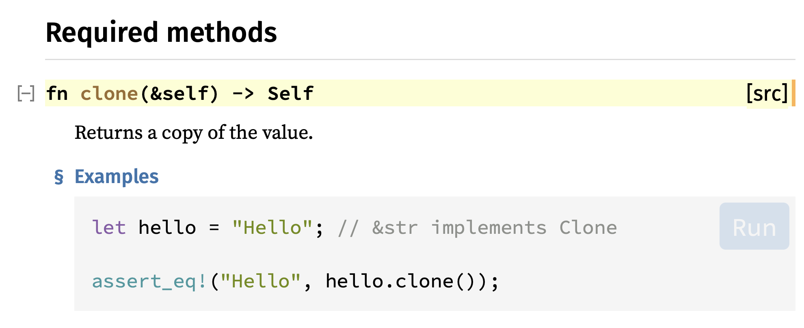

# Copy, Clone

Có một số kiểu dữ liệu trong Rust rất đơn giản (simple types),
bao gồm integers, floats, booleans (`true` và `false`), và `char`.
Các simple types này nằm trên stack bởi vì complier biết chính xác size của nó.
Chúng được gọi là **copy types**. Bởi vì nó simple và nhỏ gọn nên dễ dàng để copy,
do đó compiler luôn copy nếu bạn bỏ nó vào function.

Làm sao để biết đọc một kiểu dữ liệu có được **implement Copy** hay không.
Bạn có thể xem trong Rust document. Ví dụ `char`:
[https://doc.rust-lang.org/std/primitive.char.html](https://doc.rust-lang.org/std/primitive.char.html)

Nếu bạn thấy:

- **Copy**: có thể được copy nếu bạn bỏ nó vào function.
- **Display:** bạn có thể sử dụng `{}` để print.
- **Debug:** bạn có thể sử dụng `{:?}` để print.

```rust,editable
fn prints_number(number: i32) {
  println!("{}", number);
}

fn main() {
  let my_number = 8;
  prints_number(my_number); // Prints 8. prints_number gets a copy of my_number
  prints_number(my_number); // Prints 8 again.
                            // No problem, because my_number is copy type!
}
```

Do `i32` được Copy nên chúng ta có thể sử dụng `my_number` nhiều lần mà không cần borrow `&` như struct.

# Clone trait

Nếu bạn đọc document của String: [https://doc.rust-lang.org/std/string/struct.String.html](https://doc.rust-lang.org/std/string/struct.String.html)



String không được implement **Copy**, thay vào đó là **Clone**. Clone cũng giúp copy giá trị nhưng sẽ cần rất nhiều memory, và ta phải tự gọi method `.clone()` chứ Rust sẽ không tự Clone.

```rust,editable
fn prints_country(country_name: String) {
  println!("{}", country_name);
}

fn main() {
  let country = String::from("Duyet");
  prints_country(country);
  prints_country(country); // ⚠️
}
```

Sẽ báo lỗi, theo như compiler giải thích rằng `country` là `String` và không được implement `Copy` nên country bị move vào trong function. Do đó ta không thể sử dụng `country` được nữa.

```rust,editable
error[E0382]: use of moved value: `country`
 --> src/main.rs:8:20
  |
6 | let country = String::from("Duyet");
  |     ------- move occurs because `country` has type `String`, which does not implement the `Copy` trait
7 | prints_country(country);
  |                ------- value moved here
8 | prints_country(country); // ⚠️
  |                ^^^^^^^ value used here after move

For more information about this error, try `rustc --explain E0382`.
```

Có hai cách:

### (1) Sử dụng `.clone()`

```rust,editable
fn prints_country(country_name: String) {
  println!("{}", country_name);
}

fn main() {
  let country = String::from("Duyet");
  prints_country(country.clone()); // <-- clone
  prints_country(country);
}
```

String rất lớn, do đó `.copy()` sẽ tốn rất nhiều bộ nhớ. Sử dụng `&` để reference sẽ nhanh hơn, nếu có thể.

### (2) Sử dụng `&` reference

```rust,editable
fn prints_country(country_name: &String) {
  println!("{}", country_name);
}

fn main() {
  let country = String::from("Duyet");
  prints_country(&country);
  prints_country(&country);
}
```

{{#include ./string-str.md}}
